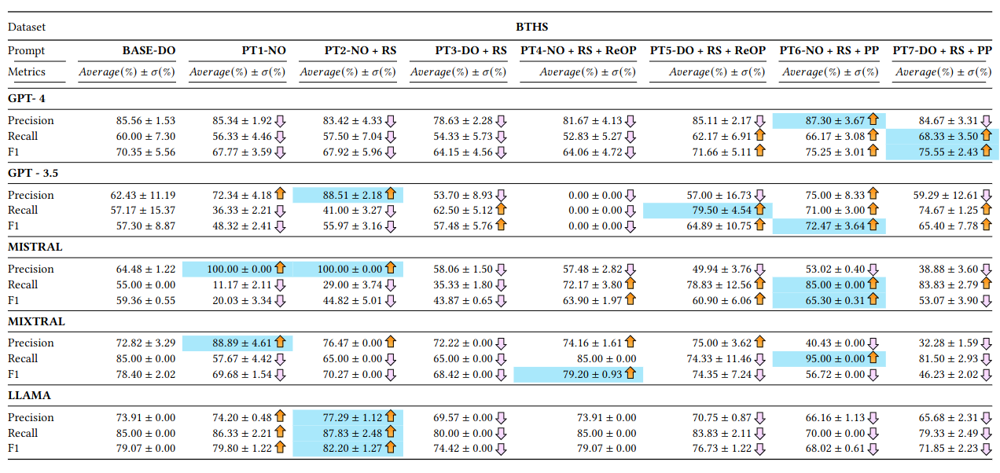
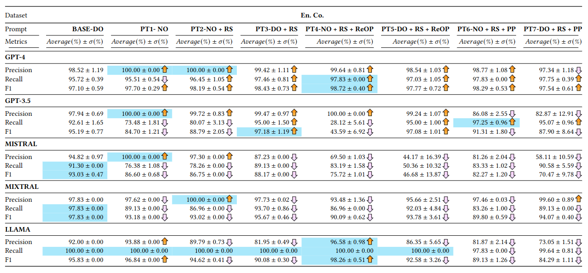

# REST-at

Requirement Engineering and Software Testing Alignment Tool

## Statistical Analysis

The scripts and files used in our evaluation are in the `analysis/` folder.

### Misc

There's two separate branches:
[`data-archive`](https://github.com/SEM25-BSc/REST-at-upstream/tree/data-archive)
and [`stable`](https://github.com/SEM25-BSc/REST-at-upstream/tree/stable). The
former contains all *archived* job runs and produced artifacts, and the latter
contains **Alvis** env. definitions.
> TBD: these may be eventually deleted; used as a handy reference. \=)

---

*(Written by Nicole \& Bao; used as a reference)*

## Models Used

The models used are stated in this section and will include the exact snapshot for the open-weight models.

- **GPT-3.5** - gpt-3.5-turbo-0125
- **GPT-4** - gpt-4-turbo-2024-04-09
- **Mistral 7B Instruct-v0.2** - [cf47bb3e18fe41a5351bc36eef76e9c900847c89](https://huggingface.co/mistralai/Mistral-7B-Instruct-v0.2/tree/cf47bb3e18fe41a5351bc36eef76e9c900847c89)
- **Mixtral 8x7B Instruct-v0.1** - [e2d44c05b53516ba61d625448a10c095aa104725](https://huggingface.co/mistralai/Mixtral-8x7B-Instruct-v0.1/tree/e2d44c05b53516ba61d625448a10c095aa104725)
- **Llama 3 70B** - [e8cf5276ae3e97cfde8a058e64a636f2cde47820](https://huggingface.co/meta-llama/Meta-Llama-3-70B-Instruct/tree/e8cf5276ae3e97cfde8a058e64a636f2cde47820)

## Performance

The average performance metrics for **REST-at** using GPT-3.5, GPT-4, Mistral 7B Instruct-v0.2, Mixtral 8x7B Instruct-v0.1, and Llama 3 70B Instruct are displayed below. The metrics of interest are: recall, precision, and F<sub>1</sub>-score.

The model-wise model-prompt pairs with the best value in a certain metric has its cell highlighted in blue.

### BTHS



### En. Co



## Data

The [`data`](./data/) folder contains all the `datasets` used as the input data of REST-at's experiments. Each `dataset` has its own sub-directory (e.g. [`BTHS/`](./data/BTHS/), [`ENCO/`](./data/ENCO/)) that includes the following files: 
- `RE.csv` - contains requirement specifications. 
- `ST.csv` - contains test case specifications.
- `mapping.csv` - contains the ground truth for the REST mappings. 

The `dataset` folders also contains randomly sampled `subsets` in separate sub-directories that are indexed starting from `01`. Each `subset` directory also includes the three types of files mentioned in the list above.

The [`archive`](./archive/) contains the output data from REST-at's experiments. Each directory under `archive` is named after one of the prompt used for REST-at, i.e., BASE and PT{1-7}. Each prompt folder contains an `out` and a `res` folder. The `out` folders contain the mapping that REST-at responded with during the experiments. The `res` folders contain the evaluations of the aforementioned mappings when compared to the ground truth.

### Sampling

The scripts used to randomly sample the `datasets` and store generated `subsets` are found in the [`Jupyter Notebook`](./data/sampling.ipynb) inside the `data` folder.

### Prompt Templates

The prompt templates (PTs) used for REST-at are available in the [`prompts`](./prompts/) folder. Below are the definitions of the different templates with placeholders.

The substrings `{req}` and `{tests}` are injection points (placeholders) for requirement data and test suite data respectively.

#### BASE (DO)

<details>
    <summary>Show</summary>

System prompt:

    You are a helpful assistant.

User prompt:

    I have this requirement:

    {req}

    Would you say that any of the test cases in the file "tests.json" are testing the requirement? If yes, answer ONLY with the test case ID(s) that are testing the requirement in the following form:

    {"requirementID": "<insert requirement id>", "tests": "<insert test id 1>, <insert test id 2>, <insert test id 3>, ..."}

    DO NOT ADD ANY TEXT BEFORE OR AFTER THE BRACKETS. If no, answer ONLY in the following form:

    {"requirementID": "<insert requirement id>", "tests": ""}

    The contents of "tests.json" are:

    {tests}

    I am going to parse your input in my Python program, therefore, ONLY ANSWER IN THE FORM I GAVE YOU.

</details>

#### PT1 (NO)

<details>
    <summary>Show</summary>

System prompt:

    You are a helpful assistant.

User prompt:

    I have this requirement:

    {req}

    Would you say that any of the test cases in the file "tests.json" are testing the requirement? If yes, answer ONLY with the test case ID(s) that are testing the requirement in the following form:

    ["<insert test id 1>", "<insert test id 2>", "<insert test id 3>", ...]

    DO NOT ADD ANY TEXT BEFORE OR AFTER THE BRACKETS. If no, answer ONLY in the following form:

    []

    The contents of "tests.json" are:

    {tests}

    I am going to parse your input in my Python program, therefore, ONLY ANSWER IN THE FORM I GAVE YOU.

</details>

#### PT2 (NO + RS)

<details>
    <summary>Show</summary>

System prompt:

    You are an expert in finding trace links between software requirements and software tests.

User prompt:

    I have this requirement:

    {req}

    Would you say that any of the test cases in the file "tests.json" are testing the requirement? If yes, answer ONLY with the test case ID(s) that are testing the requirement in the following form:

    ["<insert test id 1>", "<insert test id 2>", "<insert test id 3>", ...]

    DO NOT ADD ANY TEXT BEFORE OR AFTER THE BRACKETS. If no, answer ONLY in the following form:

    []

    The contents of "tests.json" are:

    {tests}

    I am going to parse your input in my Python program, therefore, ONLY ANSWER IN THE FORM I GAVE YOU.

</details>

#### PT3 (DO + RS)

<details>
    <summary>Show</summary>

System prompt:

    You are an expert in finding trace links between software requirements and software tests.

User prompt:

    I have this requirement:

    {req}

    Would you say that any of the test cases in the file "tests.json" are testing the requirement? If yes, answer ONLY with the test case ID(s) that are testing the requirement in the following form:

    {"requirementID": "<insert requirement id>", "tests": "<insert test id 1>, <insert test id 2>, <insert test id 3>, ..."}

    DO NOT ADD ANY TEXT BEFORE OR AFTER THE BRACKETS. If no, answer ONLY in the following form:

    {"requirementID": "<insert requirement id>", "tests": ""}

    The contents of "tests.json" are:

    {tests}

    I am going to parse your input in my Python program, therefore, ONLY ANSWER IN THE FORM I GAVE YOU.

</details>

#### PT4 (NO + RS + ReOP)

<details>
    <summary>Show</summary>

System prompt:

    Act as a mapping system, that receives a requirement and test cases 
    and returns a list of the test cases that test that specific requirement. 

    It IS CRUCIAL that your response MUST adhere to the exact
    JSON format outlined below. Incorrect formatting may result
    in your response being improperly processed.

    If any test cases are testing the requirement, answer
    ONLY with the test case ID(s) using this format for your
    report:
    ["<test ID 1>", "<test ID 2>", "<test ID 3>", ...]

    If no test cases are testing the requirement, use this format:
    []

User prompt:

    Your task is to identify and return the test cases that directly validate the requirement
    Here are the requirements:
    {req}
    and here are the test cases:
    {tests}

    Please preserve the formatting and overall template specified above.

</details>

#### PT5 (DO + RS + ReOP)

<details>
    <summary>Show</summary>

System prompt:

    Act as a mapping system, that receives a requirement and test cases 
    and returns a list of the test cases that test that specific requirement. 

    It IS CRUCIAL that your response MUST adhere to the exact
    JSON format outlined below. Incorrect formatting may result
    in your response being improperly processed.

    If any test cases are testing the requirement, answer
    ONLY with the test case ID(s) using this format for your
    report:
    {"requirementID": "<insert requirement id>", "tests": "<insert test id 1>, <insert test id 2>, <insert test id 3>, ..."}

    If no test cases are testing the requirement, use this format:
    {"requirementID": "<insert requirement id>", "tests": ""}

User prompt:

    Your task is to identify and return the test cases that directly validate the requirement
    Here are the requirements:
    {req}
    and here are the test cases:
    {tests}

    Please preserve the formatting and overall template specified above.

</details>

#### PT6 (NO + RS + PP)

<details>
    <summary>Show</summary>

System prompt:

    # Role

    Act as an API for a system that identifies trace links between software requirements and system tests.


    # Input Format

    I will give you data in the following format:

    ```
    {
    "requirement": {
        "ID": "<requirement ID>",
        "Feature": "<short feature description>",
        "Description": "<full feature description>"
    },
    "tests": [
        {
        "ID": "<test ID>",
        "Purpose": "<purpose of test>",
        "Test steps": "<steps to follow when executing test>"
        }
    ]
    }
    ```
    The "tests" field is a list of test objects.


    # Task

    Analyse the requirement and test cases and determine which test cases cover the requirement.


    # Output Format

    I will expect you to respond with a list of test IDs that cover the requirement. The following response templates are wrapped in code blocks.
    DO NOT RESPOND WITH CODE BLOCKS, DO NOT EXPLAIN YOUR SOLUTION, ONLY RESPOND WITH A LIST!


    If you find trace links, insert the test IDs in the following template:
    ```
    ["<test ID 1>", "<test ID 2>", "<test ID 3>", ...]
    ```

    If you can't find trace links, respond with the following:
    ```
    []
    ```

User prompt:

    {
      "requirement": {req},
      "tests": {tests}
    }

</details>

#### PT7 (DO + RS + PP)

<details>
    <summary>Show</summary>

System prompt:

    # Role

    Act as an API for a system that identifies trace links between software requirements and system tests.


    # Input Format

    I will give you data in the following format:

    ```
    {
    "requirement": {
        "ID": "<requirement ID>",
        "Feature": "<short feature description>",
        "Description": "<full feature description>"
    },
    "tests": [
        {
        "ID": "<test ID>",
        "Purpose": "<purpose of test>",
        "Test steps": "<steps to follow when executing test>"
        }
    ]
    }
    ```
    The "tests" field is a list of test objects.


    # Task

    Analyse the requirement and test cases and determine which test cases cover the requirement.


    # Output Format

    I will expect you to respond with a JSON string of  test IDs that cover the requirement. The following response templates are wrapped in code blocks.
    DO NOT RESPOND WITH CODE BLOCKS, DO NOT EXPLAIN YOUR SOLUTION, ONLY RESPOND WITH A JSON STRING!


    If you find trace links, insert the test IDs in the following template:
    ```
    {"requirementID": "<insert requirement id>", "tests": "<insert test id 1>, <insert test id 2>, <insert test id 3>, ..."}
    ```

    If you can't find trace links, respond with the following:
    ```
    {"requirementID": "<insert requirement id>", "tests": ""}
    ```

User prompt:

    {
      "requirement": {req},
      "tests": {tests}
    }

</details>

## Running Scripts

Scripts should be run as modules to ensure that the relative imports work. E.g.:

```bash
python -m <path.to.module> # Omit the -.py file name extension
```

## Testing Modules

Currently only some of the modules in `src/core/` are partially tested. To run the tests, run the following command from `src/`:

```bash
python -m unittest discover
```

## File Structure

The following file structures are **REQUIRED** for REST-at to work properly. All input files **MUST**
be in Comma Separated Value (`.csv`) format.

### Requirements Files

Requirements files must have the following rows (case sensitive) in whichever order:

- ID
- Feature
- Description

### Test Cases Files

Test cases files must have the following rows (case sensitive) in whichever order:

- ID
- Purpose
- Test steps

### Alignment Files

Only for development evaluations.
Alignment files must have the following rows (case sensitive) in whichever order:

- Req IDs
- Test ID
  - This column must consist of a list of Test IDs separated by commas

## Getting Started

### Prerequisites

- [Python 3.10](https://www.python.org/downloads/release/python-31014/) or later
- Hardware capable of running LLMs (large amounts of vRAM)
- A virtual Python environment (optional but recommended)

### Setting Up

Make sure that you're in the correct Python environment before you begin!

1. Clone this repository.
1. `cd` into the newly created directory.
1. Run `pip install -r requirements.txt`

### Running REST-at Scripts

Make sure that you're in the correct Python environment before you begin!

1. Create a `.env` file in the project root.
1. Add the following variables to the `.env` file:
  
    ```
    # Paths to local models
    MODEL_PATH_{MODEL_NAME}_{QUANT_TYPE}    # Path to quantized model, e.g., MODEL_PATH_MIS_AWQ
    MODEL_PATH_{MODEL_NAME}                 # Path to the original model, e.g., MODEL_PATH_MIS

    # Maximum token limits for different models
    TOKEN_LIMIT_{MODEL_NAME}: int           # Max tokens for the model e.g., TOKEN_LIMIT_MIS

    # Data paths for REST spec files
    {DATASET}_REQ_PATH: Path                # Path to the dataset request file, e.g., ENCO_REQ_PATH
    {DATASET}_TEST_PATH: Path               # Path to the dataset test file, e.g., ENCO_TEST_PATH
    {DATASET}_MAP_PATH: Path                # Path to the dataset map file, e.g., ENCO_MAP_PATH

    # Set Debug mode ON/OFF
    DEBUG_MODE=1                            # Debug mode enabled
    ```
  
2. Run one of two scripts:
    - `python -m src.send_data` - To run on a local model.
    Adjust the `session_name` variable to your desired output directory name.
    - `python -m src.send_data_gpt` - To run on OpenAI's GPT. \
    Adjust the `model` variable to your desired model.

The scripts will output files in the `out/{model}/{date}/{time}/` directory.

> **Note:** You can enable DEBUG_MODE in `.env` to see more detailed logs when running the LLMs. When enabled, the following information will be printed to the console for each model run: `Iteration nr., Raw output, Req. ID, Created links, Parsed response`. This is often helpful for tracking the progress and understanding how the model is processing each request
<details>
    <summary>Example output in DEBUG_MODE</summary>

 ```
 Iteration nr.: 1
Raw output: []
Req. ID: 4.2
Created links: []
Parsed response {'4.2': []}
Iteration nr.: 2
Raw output: ["T-2", "T-3"]
Req. ID: 4.2.1
Created links: ['HSP/AG/IAC/BV-02-I', 'HSP/HS/IAC/BV-02-I']
Parsed response {'4.2': [], '4.2.1': ['HSP/AG/IAC/BV-02-I', 'HSP/HS/IAC/BV-02-I']}
Iteration nr.: 3
Raw output: []
Req. ID: 4.2.2
Created links: []
Parsed response {'4.2': [], '4.2.1': ['HSP/AG/IAC/BV-02-I', 'HSP/HS/IAC/BV-02-I'], '4.2.2': []}
Iteration nr.: 4
Raw output: []
Req. ID: 4.3
Created links: []
Parsed response {'4.2': [], '4.2.1': ['HSP/AG/IAC/BV-02-I', 'HSP/HS/IAC/BV-02-I'], '4.2.2': [], '4.3': []} ...
 ```
</details>

### Automated experiments on Alvis

You can run automated experiments using:

`scripts/alvis-pipeline.sh`

This script handles experiment setup with predefined variables: `dataset, models, quant`. Ex: `dataset=("BTHS" "ENCO" "SNAKE") models=("mis") quant=("NONE" "AWQ")`. It automatically iterates over all combinations of these variables and runs each configuration for N iterations (set within the script).

Note: `MODEL_NAME`, `QUANT_TYPE`, `DATASET` variables names set in `.env` (see [Running REST-at Scripts](#running-rest-at-scripts)) must match exactly those defined in `alvis-pipeline`, as paths are constructed dynamically

**To run:**

1. Define all necessary experiment variables in `scripts/alvis-pipeline.sh`
2. Set up your `.env` file with the required paths
3. Launch the job on Alvis:
    - `sbatch scripts/alvis-pipeline.sh`

### Evaluating REST-at From Scripts

Make sure that you're in the correct Python environment before you begin!

1. Follow the steps in [Running REST-at Scripts](#running-rest-at-scripts)
1. Add the following variables to the `.env` file:
    - `MAP_PATH` - The relative path to the alignment file.
    - `USE_LOG` - Redirects `stdout` to `.log` files when set to `1`; preserves default behaviour when set to `0` (or if variable missing). 
2. Run one of two scripts:
    - `python -m src.eval` - To evaluate each REST trace link.
    - `python -m src.label_eval` - To evaluate "is tested" labels.

The script will output an `eval.log` or a `label-eval.log` in `out/{model}/{date}/{time}/` for each model, date, and time, depending on the script used. The file contains key metrics of REST-at, such as accuracy and precision.

The script will also output the following files in the `res/{date}/{time}(-label)` directory:

- `eval.log` - The verbose output of the evaluation.
- `res.log` - All the evaluation results.
- `{model}.log` for each model in `out/` - The average metrics of all runs with the model.
